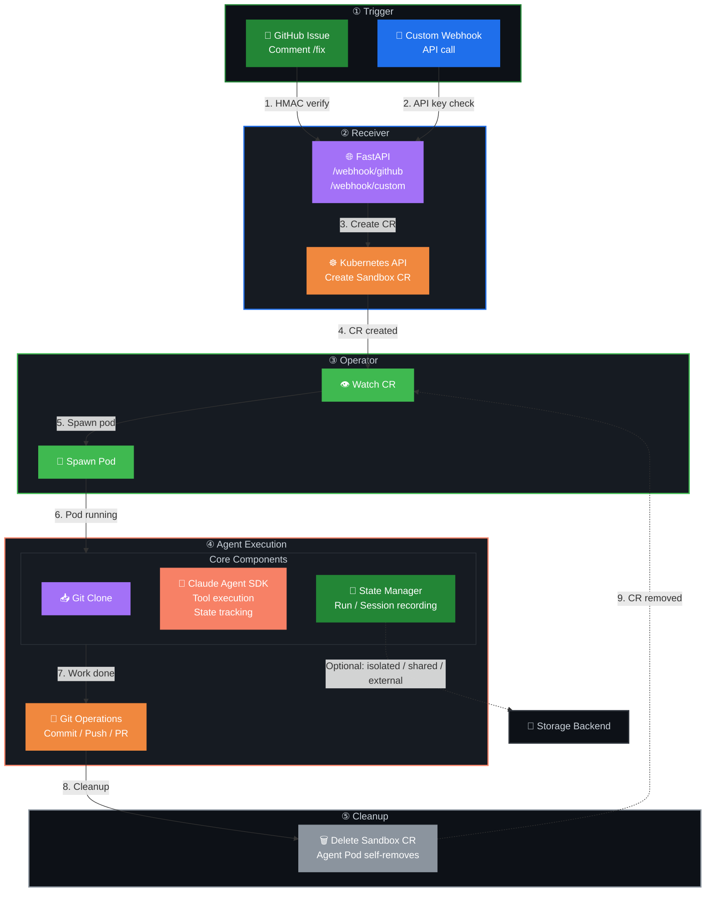

# claude-agent-runner

General-purpose [Claude Agent SDK](https://code.claude.com/docs/en/agent-sdk/overview) runner for Kubernetes. Receives webhook triggers, spawns ephemeral sandbox pods, and lets the agent work autonomously.

## How It Works



**Lifecycle Phases:**

**① Trigger** — GitHub issue with `/fix` comment or custom webhook API call

**② Receiver** — FastAPI service (`/webhook/github`, `/webhook/custom`) verifies HMAC/API key and calls Kubernetes API to create Sandbox CR

**③ Operator** — `agent-sandbox-operator` controller watches for Sandbox CRs and spawns agent pods

**④ Agent Execution** — Agent pod runs core components:
- **Git Clone** — Repository checkout
- **Claude Agent SDK** — Tool execution (Read, Write, Edit, Bash, GitHub, etc.)
- **State Manager** — Run and session recording (configurable backend)
- **Git Operations** — Commit, push, create PR

**⑤ Cleanup** — Agent deletes its own Sandbox CR, operator removes pod

**State Backend Options:**
- 🏃 **Isolated** — Ephemeral in-memory (default)
- 🔄 **Shared** — Persistent PVC with memory cache
- 🗄️ **External** — PostgreSQL or Redis database

One Docker image, two entrypoints:
- **Receiver** (default): FastAPI webhook (long-running deployment)
- **Agent** (`python -m app.agent`): runs inside ephemeral sandbox pods

One Docker image, two entrypoints:
- **Receiver** (default): FastAPI webhook (long-running deployment)
- **Agent** (`python -m app.agent`): runs inside ephemeral sandbox pods

## Quickstart

```bash
# Build
docker build -t ghcr.io/duyet/claude-agent-runner:latest .

# Deploy to Kubernetes
helm upgrade --install agent-runner ./charts/agent-runner \
  -n agent-sandbox --create-namespace \
  -f values.yaml -f secrets.local.yaml
```

## Configuration

All configuration is through environment variables. See [docs/configuration.md](docs/configuration.md) for the full reference.

### Required Secrets

Authentication with GitHub — choose either a **GitHub App** (fine-grained, recommended) or a **Personal Access Token** (simpler):

**Option A — GitHub App:**
| Variable | Source | Purpose |
|---|---|---|
| `GH_APP_ID` | GitHub App settings | GitHub App authentication |
| `GH_PRIVATE_KEY` | GitHub App private key | JWT signing for installation tokens |
| `GITHUB_WEBHOOK_SECRET` | GitHub App settings | HMAC webhook verification |

**Option B — Personal Access Token:**
| Variable | Source | Purpose |
|---|---|---|
| `GH_TOKEN` | GitHub Settings → Developer settings | Fine-grained PAT with Contents+Issues+PRs write |
| `GITHUB_WEBHOOK_SECRET` | Your own secret | HMAC webhook verification |

Set `GH_TOKEN` instead of `GH_APP_ID` + `GH_PRIVATE_KEY` for simpler setup. The agent uses whichever is provided.

### Authentication

The agent sandbox needs API credentials. Set these via Kubernetes Secret:

**Claude API (direct):**
```yaml
ANTHROPIC_API_KEY: sk-ant-...
```

**AnyRouter (route through anyrouter.dev):**
```yaml
ANTHROPIC_BASE_URL: https://anyrouter.dev/api
ANYROUTER_API_KEY: sk-ar-...
```

The SDK appends `/v1/messages`, so the base URL must stop at `/api`. Keep the `anthropic-version: 2023-06-01` header — the SDK sends it automatically.

**Cloud providers** (SDK auto-detects from env):
- `CLAUDE_CODE_USE_BEDROCK=1` + AWS credentials → Amazon Bedrock
- `CLAUDE_CODE_USE_VERTEX=1` + GCP credentials → Google Vertex AI
- `CLAUDE_CODE_USE_FOUNDRY=1` + Azure credentials → Azure AI Foundry

### Permissions & Tools

Default permission mode: `auto` (background safety checks, blocks dangerous actions).

Default allowed tools: `Read,Write,Edit,Bash,Glob,Grep,GitHub,WebSearch,WebFetch`

| Tool | Purpose |
|---|---|
| Read | Read files in working directory |
| Write | Create new files |
| Edit | Edit existing files |
| Bash | Run terminal commands, git, scripts |
| Glob | Find files by pattern |
| Grep | Search file contents with regex |
| Git | Git operations |
| GitHub | GitHub API (PRs, issues, etc.) |
| WebSearch | Search the web |
| WebFetch | Fetch and parse web page content |
| Monitor | Watch background script output |
| Agent | Spawn sub-agents |

Override with `ALLOWED_TOOLS` env var.

### Skills, Plugins & MCP

```yaml
# SDK skill discovery (auto-discovers .claude/skills/ in the cloned repo)
SETTING_SOURCES: user,project
SKILLS: all

# Load skills from directories as plugins (comma-separated paths)
SKILLS_DIR: /opt/skills/custom,/opt/skills/testing

# Extra plugin directories (JSON array)
PLUGINS: '[{"type": "local", "path": "/opt/plugins/my-plugin"}]'

# MCP servers (JSON)
MCP_SERVERS: '{"playwright": {"command": "npx", "args": ["@playwright/mcp@latest"]}}'
```

## Webhook Endpoints

### `POST /webhook/github`

GitHub webhook receiver. Verifies HMAC-SHA256, handles `issue_comment` with trigger phrase (default: `/fix`). Creates a Sandbox CR for matching comments.

### `POST /webhook/custom`

Generic webhook receiver. Verifies API key (`X-API-Key` header or `api_key` query param). Accepts:

```json
{
  "repo_full": "owner/repo",
  "number": 1,
  "title": "Fix the bug",
  "body": "Description of the issue",
  "instruction": "Extra instructions for the agent"
}
```

### `GET /healthz`

Health check — returns `{"ok": true}`.

## Sandbox Pod Spec

Each sandbox runs with:
- **Non-root**: UID/GID 1000
- **Read-only rootfs**: prevents system modification
- **No capabilities**: all Linux capabilities dropped
- **No privilege escalation**: `allowPrivilegeEscalation: false`
- **Resource limits**: CPU 200m request / 1000m limit, Memory 512Mi / 2Gi
- **Timeout**: `activeDeadlineSeconds: 1200` (20 min)
- **Ephemeral storage**: 2Gi PVC (deleted with pod)
- **Environment**: all vars from Secret + ConfigMap injected via `envFrom`

## GitHub App Setup

Create a GitHub App with:
- **Permissions**: Contents (R&W), Issues (R&W), Pull requests (R&W)
- **Subscribe to**: `issue_comment` events
- Install on target repos

Set `GH_APP_ID` and `GH_PRIVATE_KEY` in the sandbox Secret.

## Development

```bash
# Install dependencies (requires uv: https://docs.astral.sh/uv/)
uv sync

# Run receiver locally
uv run uvicorn app.receiver:app --reload --port 8080

# Test health
curl http://localhost:8080/healthz

# Run agent locally (with TASK_JSON env)
python -m app.agent
```

## License

MIT
