# Architecture

## System Architecture

```mermaid
flowchart LR
    subgraph Input["🔵 Inputs (external)"]
        GH["GitHub Webhook<br/>issue_comment"]
        GL["GitLab Webhook<br/>Note / Issue Hook"]
        CUSTOM["Custom API<br/>POST /webhook/custom"]
        POLL["GitHub Poller<br/>every 3 min"]
        GLPOLL["GitLab Poller<br/>issues / MRs"]
        HERMES["Hermes Agent<br/>Telegram trigger"]
    end

    subgraph Receiver["🔵 Receiver (long-lived Deployment)"]
        V["Verify → Allowlist → Create CR"]
    end

    subgraph CRD["🟡 Sandbox CR (per-task)"]
        POD["spec.podTemplate<br/>PodSpec + envFrom"]
        PVC["spec.volumeClaimTemplates<br/>ephemeral workspace"]
        META["metadata.annotations<br/>repo / issue / reason"]
    end

    subgraph Operator["🔵 agent-sandbox Operator (long-lived)"]
        W["Watch Sandbox CR"]
        S["Spawn ephemeral pod"]
        CL["CR deleted → cleanup pod"]
    end

    subgraph Agent["🟠 Sandbox Pod (ephemeral, one-shot)"]
        GIT["Clone repo"]
        SDK["Claude Agent SDK<br/>headless"]
        SCOPE["Tools / Skills /<br/>Plugins / MCP"]
        DONE["Commit → PR →<br/>Self-delete CR"]
        SDK --- SCOPE
    end

    Input -->|trigger| Receiver
    Receiver -->|create| CRD
    CRD -.->|watch| Operator
    Operator -->|spawn| Agent
    Agent -->|self-delete| CRD
    CRD -.->|cleanup| Operator

    style CRD fill:#1a1a2e,stroke:#e94560
    style Operator fill:#16213e,stroke:#0f3460
    style Agent fill:#3d1a1a,stroke:#e94560
    style Receiver fill:#16213e,stroke:#0f3460
```



## Component Details

### 1. Webhook Receiver (receiver.py)

FastAPI service that runs as a long-lived deployment.

- Verifies GitHub webhook HMAC-SHA256 signatures
- Verifies GitLab webhooks via a plain `X-Gitlab-Token` header (compared to `GITLAB_WEBHOOK_SECRET`)
- Supports optional API key auth for `/webhook/custom`
- Filters by sender allowlist and trigger phrase
- Creates Sandbox CR via Kubernetes API
- Endpoints: `/webhook/github`, `/webhook/gitlab`, and `/webhook/custom`

Each incoming task is tagged with a `provider` field (`github` | `gitlab`) that flows
through to the Sandbox CR and the agent, selecting the right token acquisition, clone URL,
prompt wording, and failure-comment API downstream.

### 2. Sandbox CR (k8shelper.py)

Creates Kubernetes Custom Resources of kind `Sandbox` (`agents.x-k8s.io/v1alpha1`).

The CR includes:
- **Pod template**: full PodSpec with security context, resource limits, volumes
- **Volume claim templates**: ephemeral PVC for workspace
- **No ClusterIP service**: sandbox pods are headless

Env vars from Secret (`SANDBOX_SECRET_REF`) and ConfigMap (`SANDBOX_CONFIGMAP_REF`) are injected into the pod automatically.

### 3. Agent (agent.py)

Runs inside each sandbox pod as a one-shot task:

1. Clone the target repo (depth 50)
   - **GitHub** tasks clone with the installation/PAT token over HTTPS
   - **GitLab** tasks clone via `https://oauth2:<GITLAB_TOKEN>@<host>/<group/project>.git`
     (host derived from `GITLAB_URL`, default `https://gitlab.com`, so self-hosted works)
2. Set the provider credentials for the agent's tools:
   - **GitHub**: `GH_TOKEN` / `GITHUB_TOKEN` for the GitHub tool
   - **GitLab**: `GITLAB_TOKEN` + `GITLAB_URL` for `glab` / the GitLab API
3. Launch Claude Agent SDK in headless mode with full SDK capabilities:
   - **Tools**: Read, Write, Edit, Bash, Glob, Grep, Git, GitHub, WebSearch, WebFetch, Monitor, Agent
   - **Skills**: Auto-discovered from `.claude/skills/` in the cloned repo
   - **Plugins**: Directories loaded via `SKILLS_DIR` / `PLUGINS` env
   - **MCP servers**: Configured via `MCP_SERVERS` JSON env var
4. Agent explores code, makes changes (governed by `CLAUDE_PERMISSION_MODE`), commits, pushes, opens a change request
   - **GitHub** agents open a **Pull Request**
   - **GitLab** agents open a **Merge Request** (prompt wording steers the agent to use `glab` / the GitLab API)
5. On failure, the agent posts a comment back to the source issue/MR via the provider API
   - **GitHub**: issue/PR comments API
   - **GitLab** notes API: `POST {GITLAB_URL}/api/v4/projects/{url-encoded path}/issues/{iid}/notes`
6. Self-deletes the Sandbox CR on completion → operator cleans up the pod

The agent is configured entirely through env vars — no hardcoded behaviour. All tools, permissions, model selection, and SDK settings come from the environment injected via `envFrom` (Secret + ConfigMap refs in the Sandbox CR).

### 4. GitHub App Auth (gh_token.py)

GitHub App JWT → installation access token flow:

- JWT minted with 9-minute expiry (max allowed: 10 min)
- Installation token cached with 60-min TTL, refreshed 5 min before expiry
- Uses `GH_APP_ID` and `GH_PRIVATE_KEY` env vars

### 5. GitLab Auth

GitLab uses a static access token — there is no GitHub-App / installation-token equivalent:

- `GITLAB_TOKEN`: a Personal, Group, or Project access token (with `api` / `write_repository` scope)
- `GITLAB_URL`: API/host base (default `https://gitlab.com`); set to your self-hosted instance URL
- Clone URL is built as `https://oauth2:<GITLAB_TOKEN>@<host>/<group/project>.git`
- The same token is used for the GitLab API (creating Merge Requests, posting failure notes)

The token is long-lived (rotation is manual), so unlike the GitHub App flow there is no JWT
minting or token-refresh step.

## Data Flow

### GitHub Webhook Flow

```
issue_comment created with /fix
  ↓
HMAC-SHA256 signature verification
  ↓
Sender allowlist check
  ↓
Trigger phrase check (default: /fix)
  ↓
Create Sandbox CR with task payload
  ↓
agent-sandbox operator spawns pod
  ↓
Pod: clone repo → Claude SDK session → fix → commit → push → PR
  ↓
Pod self-deletes Sandbox CR
```

### GitLab Webhook Flow

```
POST /webhook/gitlab  (also /api/v1/webhook/gitlab)
  ↓
X-Gitlab-Token header == GITLAB_WEBHOOK_SECRET  (plain compare, NOT HMAC)
  ↓
Dispatch on X-Gitlab-Event header:
  • "Note Hook"  → comment with trigger phrase on an Issue or Merge Request
  • "Issue Hook" → issue opened with the configured label
  ↓
Sender allowlist check
  ↓
Create Sandbox CR with task payload (provider=gitlab)
  ↓
agent-sandbox operator spawns pod
  ↓
Pod: clone repo (oauth2 token) → Claude SDK session → fix → commit → push → Merge Request
  ↓
Pod self-deletes Sandbox CR
```

### Custom Webhook Flow

```
POST /webhook/custom
  ↓
API key verification
  ↓
Parse JSON payload
  ↓
Create Sandbox CR (same as GitHub flow)
```

## Security

- **HMAC-SHA256**: GitHub webhook signature verification (timing-safe compare)
- **GitLab token**: `X-Gitlab-Token` header compared to `GITLAB_WEBHOOK_SECRET` (plain shared-secret, not HMAC)
- **API key auth**: Optional for `/webhook/custom` endpoint
- **Sender allowlist**: Restrict which GitHub / GitLab users can trigger
- **Sandbox isolation**:
  - Non-root user (UID 1000)
  - Read-only root filesystem
  - All Linux capabilities dropped
  - No privilege escalation
  - Resource limits on CPU/memory
  - `activeDeadlineSeconds` pod timeout
- **GitHub App auth**: JWT-based with short-lived installation tokens
- **GitLab token auth**: static `GITLAB_TOKEN` (Personal/Group/Project token), injected via Secret

## Pull Mode Flow (homelab, no public webhook)

GitHub issue created on duyet/infra
  ↓
Poller checks every 3 minutes via GitHub API
  ↓
New issue detected → de-duplicated via persistent state
  ↓
Create Sandbox CR (same path as webhook flow)
  ↓
Agent spawns → analyzes → fixes → commit → PR → self-deletes
  ↓
ArgoCD reconciles duyet/infra → cluster updated
  ↓ (self-improvement loop)

### GitLab Poller (optional)

When the receiver has no public endpoint reachable by GitLab webhooks, an optional GitLab
poller (built on [`python-gitlab`](https://python-gitlab.readthedocs.io)) provides the same
pull-based path as the GitHub poller:

- `PULL_MODE_GITLAB_ENABLED`: turn the GitLab poller on
- `PULL_MODE_GITLAB_PROJECTS`: comma-separated GitLab project paths to poll
- `PULL_MODE_GITLAB_EVENTS`: which event types to poll (issues, merge requests)

It polls issues and merge requests on the configured projects (against `GITLAB_URL` using
`GITLAB_TOKEN`), de-duplicates via the same persistent state, and creates Sandbox CRs with
`provider=gitlab` — identical downstream flow to the webhook path.
