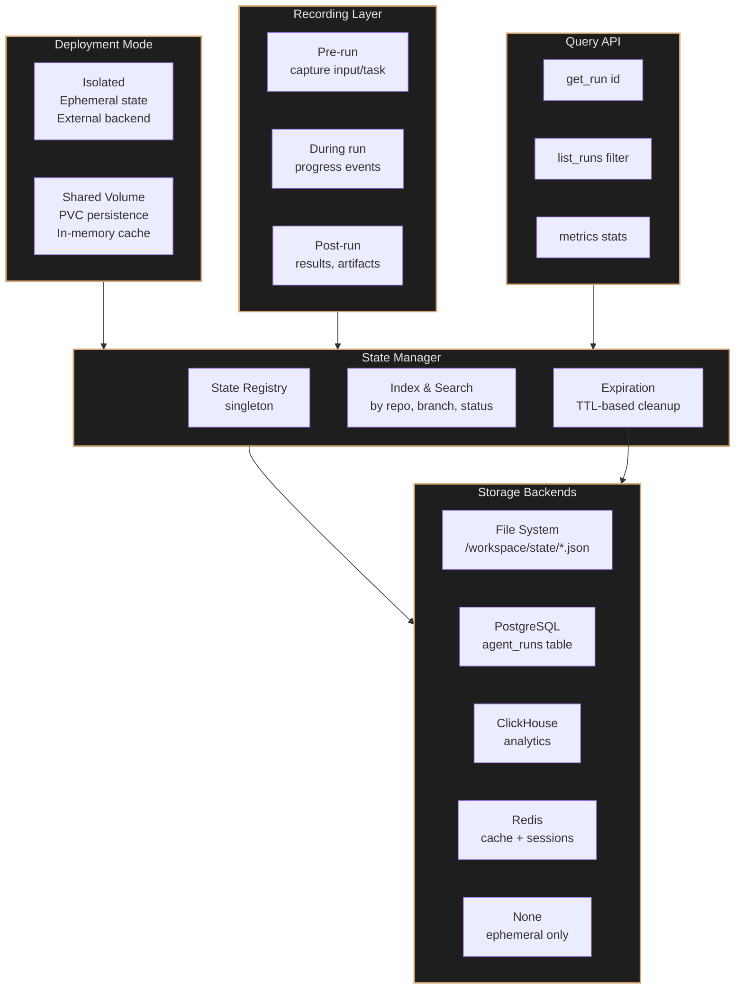

# State Management & Persistent Sessions

## Overview

The agent-runner needs to maintain state across runs to provide:
- Run history and audit trails
- Session persistence for resumption
- Metrics and observability
- Debugging and troubleshooting support

## Architecture

### Deployment Modes

**Isolated Mode (Default)**: Each agent pod has ephemeral state, lost on pod deletion. State stored in pod's ephemeral storage or written to external backend.

**Shared Volume Mode**: State persisted across runs via shared PVC. Previous sessions kept in memory for fast access and context continuity.



## Environment Variables

### Deployment Mode

| Variable | Type | Default | Purpose |
|----------|------|---------|---------|
| `STATE_MODE` | string | `isolated` | Deployment mode: `isolated` (ephemeral) or `shared` (persistent PVC) |
| `STATE_SHARED_PVC` | string | `agent-runner-state` | PVC name for shared mode state persistence |
| `STATE_SHARED_MOUNT` | string | `/workspace/state-shared` | Mount path for shared state volume |
| `STATE_MEMORY_CACHE_SIZE` | int | `100` | Max recent runs to keep in memory (shared mode) |

### Storage Configuration

| Variable | Type | Default | Purpose |
|----------|------|---------|---------|
| `STATE_BACKEND` | string | `none` | Storage backend: `none`, `file`, `postgres`, `clickhouse`, `redis` |
| `STATE_PATH` | string | `/workspace/state` | File system storage directory (local to pod) |
| `STATE_SHARED_PATH` | string | `/workspace/state-shared` | File system path on shared volume |
| `STATE_POSTGRES_URL` | string | - | PostgreSQL connection string |
| `STATE_CLICKHOUSE_URL` | string | - | ClickHouse HTTP URL |
| `STATE_REDIS_URL` | string | - | Redis URL |
| `STATE_TABLE_PREFIX` | string | `agent_runner` | Table prefix for SQL backends |

### Retention & Cleanup

| Variable | Type | Default | Purpose |
|----------|------|---------|---------|
| `STATE_RETENTION_DAYS` | int | `30` | Days to keep run records |
| `STATE_MAX_RUNS` | int | `10000` | Maximum runs to keep per repo |
| `STATE_CLEANUP_INTERVAL_HOURS` | int | `24` | Cleanup task interval |
| `STATE_COMPRESS_AFTER_DAYS` | int | `7` | Compress old records after N days |

### Session Persistence

| Variable | Type | Default | Purpose |
|----------|------|---------|---------|
| `STATE_SESSION_ENABLED` | bool | `true` | Enable session recording |
| `STATE_SESSION_COMPRESSION` | bool | `true` | Compress session data |
| `STATE_SESSION_MAX_SIZE_MB` | int | `10` | Max session size before truncation |

## Data Model

### Run Record

```json
{
  "run_id": "uuid",
  "sandbox_name": "fix-owner-repo-123-1718456789",
  "repo_full": "owner/repo",
  "repo_url": "https://github.com/owner/repo",
  "branch": "fix/issue-123",
  "trigger": {
    "type": "github_issue_comment",
    "user": "username",
    "trigger_phrase": "/fix",
    "issue_number": 123,
    "comment_body": "Fix this bug"
  },
  "status": "running|completed|failed|timeout",
  "started_at": "2024-06-16T12:34:56Z",
  "completed_at": "2024-06-16T12:45:23Z",
  "duration_seconds": 634,
  "model": "claude-sonnet-4-5-20250929",
  "max_turns": 50,
  "actual_turns": 15,
  "result": {
    "exit_code": 0,
    "summary": "Fixed bug in authentication flow",
    "files_changed": ["src/auth.py", "tests/test_auth.py"],
    "commits": ["abc123", "def456"],
    "pr_number": 456,
    "pr_url": "https://github.com/owner/repo/pull/456"
  },
  "error": null,
  "session_id": "uuid",
  "metadata": {
    "git_sha": "abc123def456",
    "base_branch": "main",
    "labels": ["bug", "auth"]
  }
}
```

### Session Record

```json
{
  "session_id": "uuid",
  "run_id": "uuid",
  "started_at": "2024-06-16T12:34:56Z",
  "messages": [
    {
      "role": "user",
      "content": "Fix GitHub issue #123",
      "timestamp": "2024-06-16T12:34:56Z"
    },
    {
      "role": "assistant",
      "content": "I'll analyze the issue...",
      "tools_used": ["Read", "Grep"],
      "timestamp": "2024-06-16T12:35:10Z"
    }
  ],
  "compressed": true,
  "size_bytes": 12345
}
```

## Implementation Plan

1. **Create state manager module** (`app/state.py`)
   - Abstract base class for storage backends
   - File system backend (default)
   - PostgreSQL backend (optional)
   - Redis backend (optional)

2. **Integrate into agent.py**
   - Record run start
   - Capture progress events
   - Record completion/failure
   - Session recording

3. **Add API endpoints to receiver.py**
   - `GET /api/v1/runs` - list runs with filters
   - `GET /api/v1/runs/{id}` - get run details
   - `GET /api/v1/runs/{id}/session` - get session transcript
   - `DELETE /api/v1/runs/{id}` - delete run record
   - `GET /api/v1/metrics` - aggregate metrics

4. **Add cleanup job**
   - Background task to expire old records
   - Compression of old data
   - Enforcement of retention policies

## Storage Backend Details

### File System (Default)

```
/workspace/state/
├── runs/
│   ├── 2024/
│   │   ├── 06/
│   │   │   ├── 16/
│   │   │   │   ├── run-uuid1.json
│   │   │   │   ├── run-uuid2.json
│   │   │   │   └── .index.json # daily index
├── sessions/
│   └── 2024/06/16/
│       ├── session-uuid1.json.gz
│       └── session-uuid2.json.gz
└── metrics.json
```

### PostgreSQL Schema

```sql
CREATE TABLE agent_runs (
    run_id UUID PRIMARY KEY,
    sandbox_name TEXT NOT NULL,
    repo_full TEXT NOT NULL,
    branch TEXT,
    status TEXT NOT NULL,
    started_at TIMESTAMPTZ NOT NULL,
    completed_at TIMESTAMPTZ,
    duration_seconds INTEGER,
    model TEXT,
    max_turns INTEGER,
    actual_turns INTEGER,
    result JSONB,
    error TEXT,
    session_id UUID,
    metadata JSONB,
    INDEX idx_repo_full (repo_full),
    INDEX idx_status (status),
    INDEX idx_started_at (started_at)
);

CREATE TABLE agent_sessions (
    session_id UUID PRIMARY KEY,
    run_id UUID NOT NULL REFERENCES agent_runs(run_id),
    started_at TIMESTAMPTZ NOT NULL,
    messages JSONB NOT NULL,
    compressed BOOLEAN DEFAULT FALSE,
    size_bytes INTEGER,
    INDEX idx_run_id (run_id)
);
```

## Security & Privacy

- **Sanitization**: Remove sensitive tokens from stored sessions
- **Access control**: State API respects `ALLOWED_USERS`
- **Encryption**: Optional encryption for sensitive data at rest
- **Compliance**: GDPR delete capability via `DELETE /api/v1/runs/{id}`

## Monitoring & Observability

State manager exposes Prometheus metrics:
- `agent_runner_runs_total{status}`
- `agent_runner_run_duration_seconds{repo}`
- `agent_runner_active_runs`
- `state_storage_operations_total{backend,operation}`
